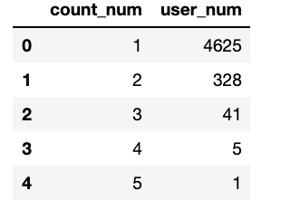
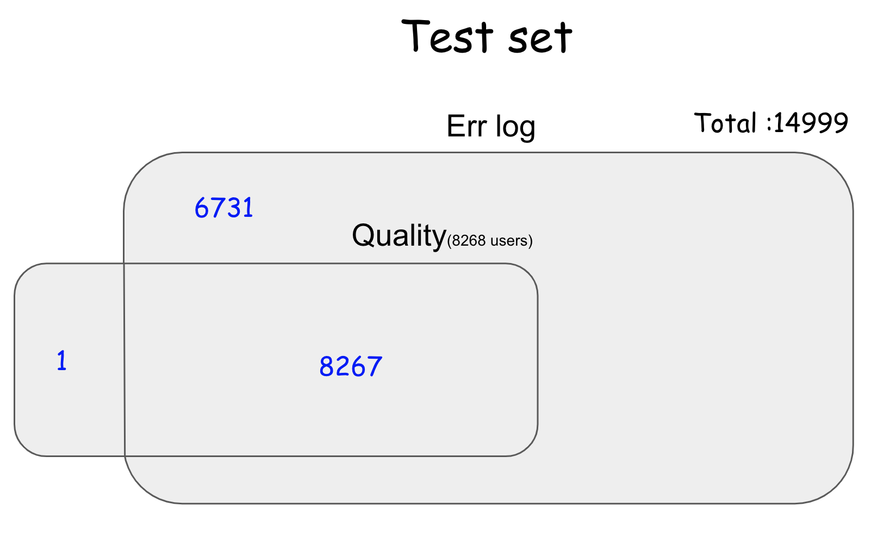
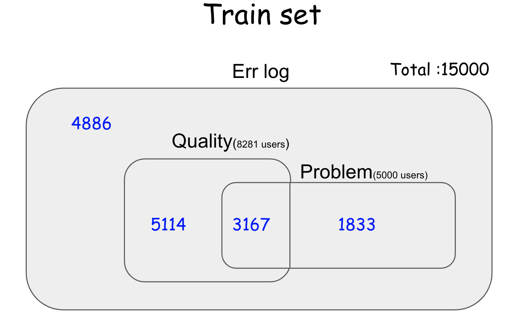

# Dacon_LG

1. problem data 에서 multi count 되는 분들의 케이스를 각각 나눠서 분석

    

2. Problem 데이터 
특정 에러 발생 → 특정시점이후에 발생 하는 것같지 않다. 
전체 에러발생데이터가 주기성을 가지는 이유?

1. 제안 사항

- 데이터 분석의 분업
1. err - problem , quality - problem 나눠서 분석
 

    

    - 베이스 라인의 경우 Err 데이터만 사용
    - 2가지 모델을 제작하는것? 
    1. Quality 데이터가 존재하는 user_id
    2. err 데이터만 존재하는 user_id
    3.
    

        
    
    
    - Err -problem ( p  vs np)
    - Quality - problem ( p vs np)

    2. auc 방식에 대한 이해 및 공유

    3. lgbm 자체 정리 필요

    4. 발표시 간단한 요약 정리? 코드가 많으면 이해하기 어려워보임

