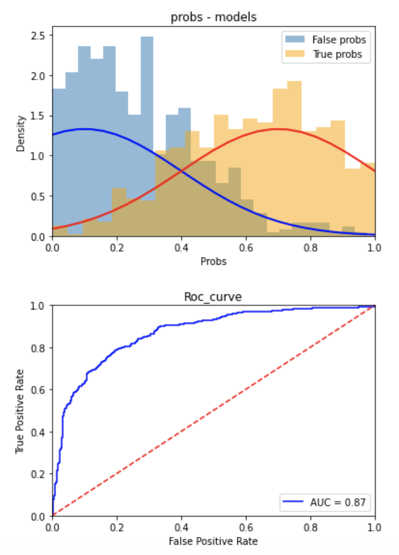
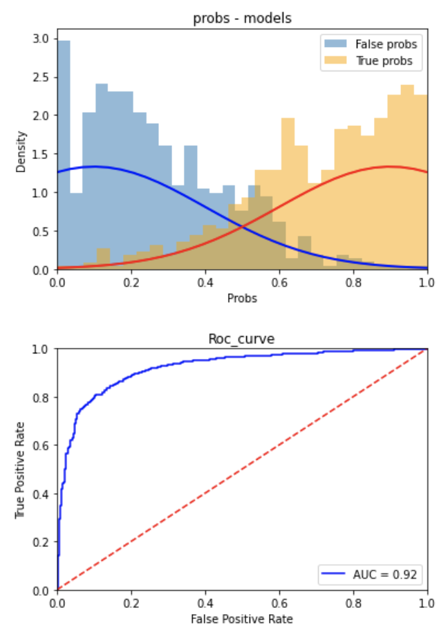
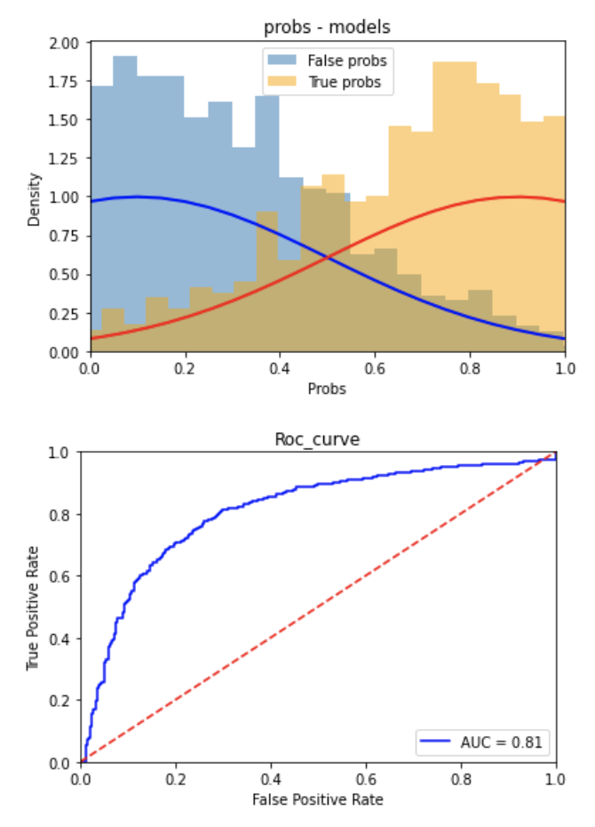
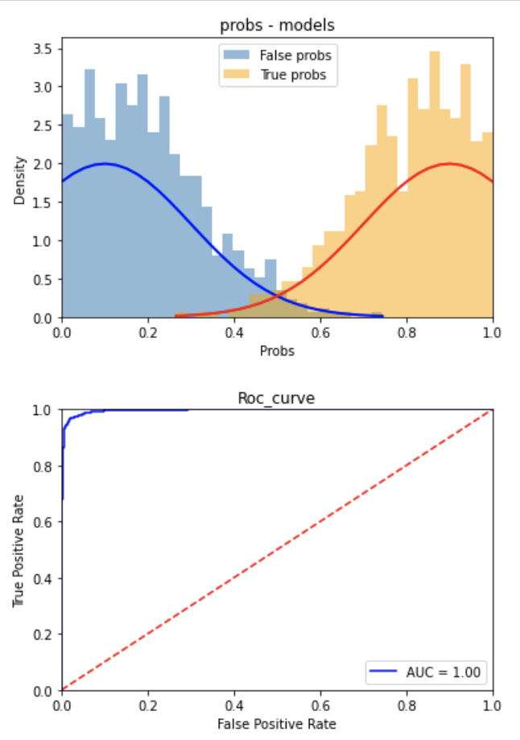
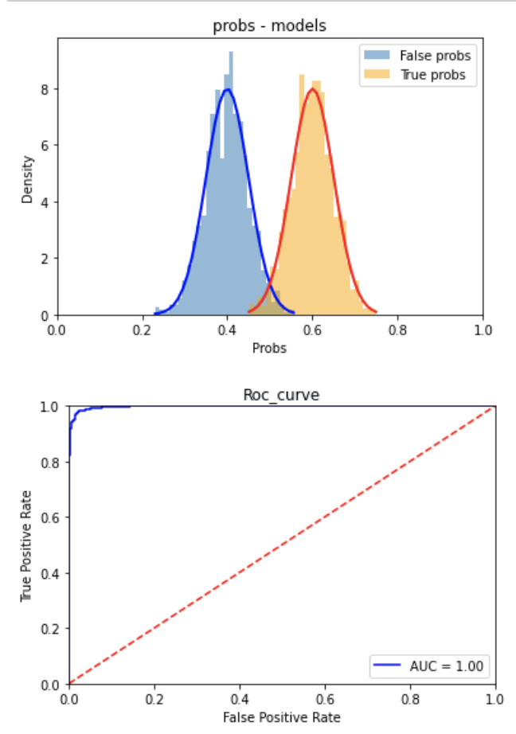
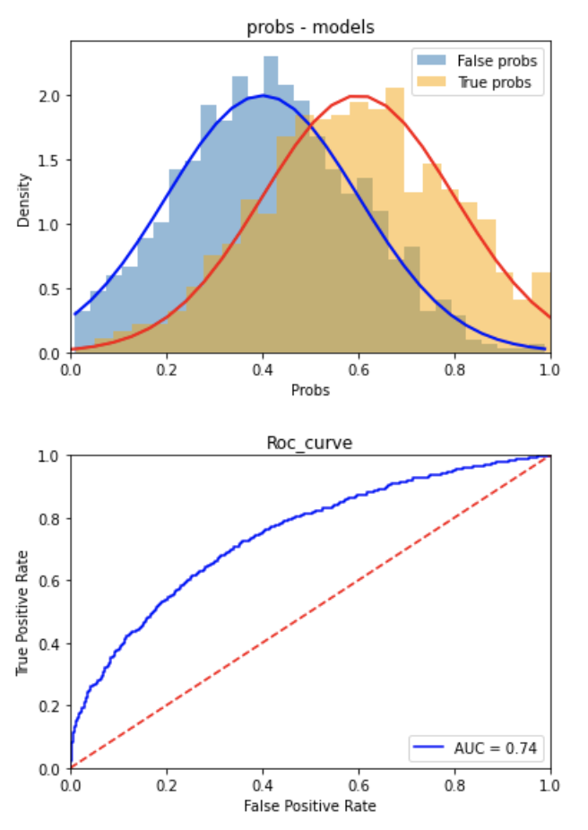
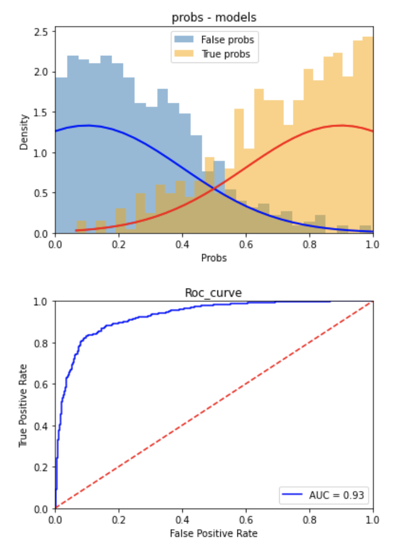
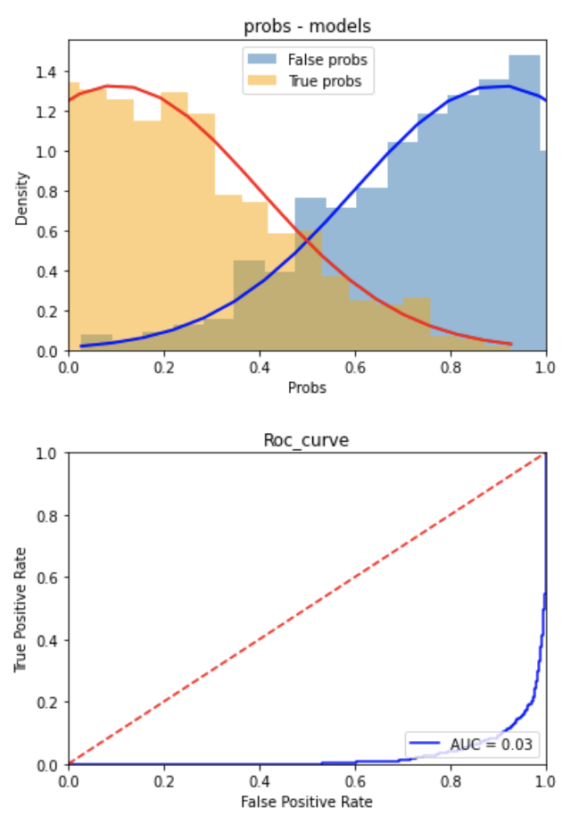
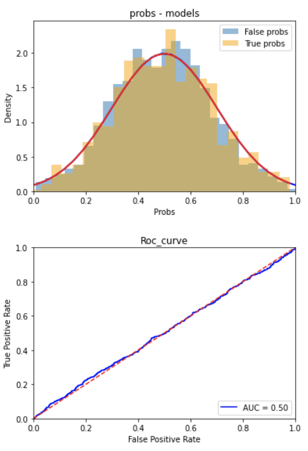

## auc 그래프 
- 그래프 예시 ./code/0110_auc_check.ipynb 

      

## auc 관련 자료
https://sumniya.tistory.com/26    
https://tykimos.github.io/2017/05/22/Evaluation_Talk/ -> 분류 지표 개념정리   
https://angeloyeo.github.io/2020/08/05/ROC.html  -> roc curve 상세 정리    
http://www.navan.name/roc/   -> threshhold , target 변화에 따른 이동 양상 파악가능     
https://www.dataschool.io/roc-curves-and-auc-explained/ -> 위 그래프 글로 설명    
https://people.inf.elte.hu/kiss/13dwhdm/roc.pdf 근본 논문    
https://www.kaggle.com/lct14558/imbalanced-data-why-you-should-not-use-roc-curve -> roc curve의 한계    
https://www.jeremyjordan.me/imbalanced-data/ -> 시각화 및 내용 정리    
https://www.kaggle.com/c/microsoft-malware-prediction/discussion/76013 -> custom auc (use numba for gpu) x15 than sklearn
https://www.kaggle.com/nirajvermafcb/comparing-various-ml-models-roc-curve-comparison -> 여러가지 모델 roc_curve

## 유사 competition

1. https://www.kaggle.com/c/instant-gratification/data?select=train.csv -> 익명화 이진분류    
- https://www.kaggle.com/c/instant-gratification/discussion/97047#562826 위 대회 참고 코드
- https://www.kaggle.com/cdeotte/3-clusters-per-class-0-975 pesudo labeling

## 개념정리

- recall = 재현율 = 민감도 = sensitivity = True positive rate (양성      / 전체 양성)    
- precision = 정밀도 =                 (양성      / 모델 양성 )    
- specificity = 특이도                 (판정중 음성 / 전체음성)
- 민감도 <-> 특이도 상대 개념 (더해서 100% 아님)
- 통상적인 분류 모델의 경우 50%를 기준으로 판단한다. (threshhold)    
- roc curve 의 x축은 1-specificity , y축은 recall(sensitivity) 값이다.    
- 학습시 데이터나 모델에 따라 threshhold 값이 0.5가 아닌 다른 값으로 지정하는 경우 존재ㄴ    
