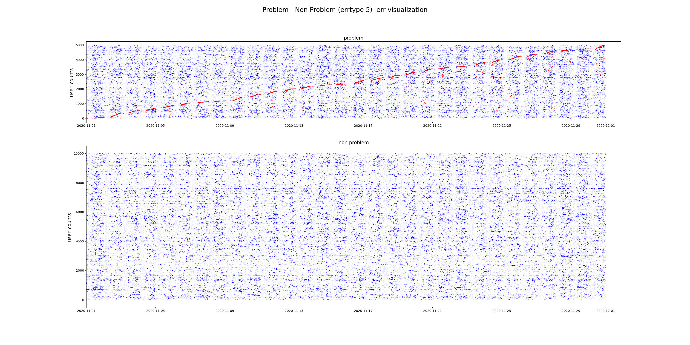
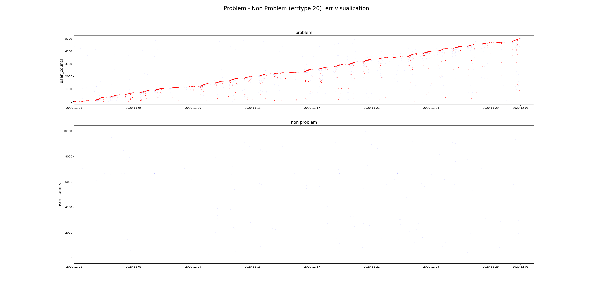

## err , problem data EDA

### 1. 모델 변경 횟수 분포 확인    
          train                      test

- 모델 변경은 순차적으로 일어난다. a모델 사용시기 종료 -> b 모델 사용
- 1번 모델을 바꾼 사람의 경우 (641/700) ->91%의 확률로 불만 제기
- 2번 모델을 바꾼 사람의 경우 (2/3)-> 불만 제기 -> 이중 불만제기 2명(13991,20921)은 a모델 -> b 모델 -> a모델
  
- 파생변수로서 매우 적절해보임 (모델변경 횟수)
  

******

### 모델 변화의 경향
# 
- train

- test

*****
### 모델변화 700명의 에러 발생시점 (발생시점에 따른 sorting)
# 

모델이 바뀌는 시점에서 problem occur이 많이 발생하는 것을 확인 할 수 있다.    
파생변수로 선택하기 적합해보임 

# 
### plot 자료 및 다음 스텝
- Model 과 Errtype에 따른 problem non-problem 유저들의 err 발생 시점을 확인
- model의 경우 1,2,3,4번이 p - np 차이가 뚜렷해보임
- errtype의 경우 1,3,4,5,6,7,10,11,12,17,22,23,24,27,28,32,34 p -np 차이보임
- 이들을 통한 파생변수생성 해야할것
- 전체 주차 대비 각 주차의 errtype 빈도 등을 만들 예정 -> 우선 p - np 의 각 타입별 통계적 차이 검정
- 

#   
### model 별 problem 발생시점
                                            model 0 

                                            model 1

                                            model 2 

                                            model 3 

                                            model 4 

                                            model 5 

                                            model 6 

                                            model 7 

                                            model 8 

*****
### errtype별 problem 발생시점
                                            err 1 

        

                                            err 2

                                            err 3

                                            err 4

                                            err 5

                                            err 6

                                            err 7

                                            err 8

                                            err 9

                                            err 10

                                            err 11

                                            err 12

                                            err 13

                                            err 14

                                            err 15

                                            err 16

                                            err 17

                                            err 18

                                            err 19

                                            err 20

                                            err 21

                                            err 22

                                            err 23

                                            err 24

                                            err 25

                                            err 26

                                            err 27

                                            err 28

                                    err 29 은 train_test 모두 없음

                                            err 30

                                            err 31

                                            err 32

                                            err 33

                                            err 34

                                            err 35

                                            err 36

                                            err 37

                                            err 38

                                            err 39

                                            err 40

                                            err 41

                                            err 42

