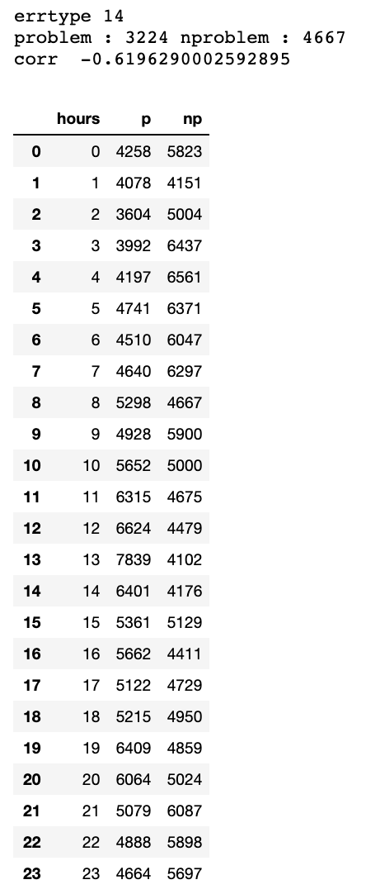

# 유저는 언제 불만을 느낄 것 인가? 그리고 그 불만을 표현할 것인가?
- 불만사항이 생길때 불만을 느낀다.
- 불만사항이라 하면 기존과는 다른 상황에 놓여 느끼는 감정
- 기존과 다른 상황은 펌웨어의 변화, 특정 에러등을 통해 구체화 될 것
- 로그는 특정 순간의 상황을 대변 
- 본 대회의 문제는 '언제 불만을 표출할 것인가' 아니라 '불만을 표출할 것인가'를 예측하는 것
- 우리는 유저가 불만을 느낄 변화상황에 놓인 적이 있는지, 그리고 그러한 상황에 대해 불만 표출을 할것인지를 판단해야한다.
  

*********

# 궁금증들
> 에러로그는 유저의 실제 활동을 나태나는가? 실제 모든 활동에 대한 에러로그인지 아닌지 (0,1번의 경향을 파악하면 좋을듯 on off로 예상)     
- 불만 제기 순간의 모든 time이 에러로그에 포함되는지 확인해보기    
    - err로그 시간과 problem 시간이 동일한 경우는 존재하지않는다.

> 모델, fmwer 변화에 대해서 추적해보자
- _모델 변화에 따른 판단은 진행했었다. 모델과 펌웨어를 같이 진행해보자_ 
- _같은 모델내에서 펌웨어가 변하는 경우를 중점으로 확인_   
- _fmwer의 경우 test, train의 unique 값이 다른 경우가 존재_
- _펌웨어의 업데이트는 강제로 하는것인지, 사용자의 선택에 따른것인지 확인해볼 필요있음 (핸드폰 업데이트의 경우 사용자가 원할때 진행함)_    
    구글 오류 보고처럼 , 사용자에게 보고창을 먼저 띄우고 사용자의 판단에 의해 보낼지 말지를 선택할 것같다.
- fmwer 타입 별로 quality10 data의 max값의 차이가 존재해보임

> quality data 살펴보던중
- 불만 제기 후 , 펌웨어의 버전 업데이트가 많은것 같다. (14244 예외 펌웨어 업데이트 후 불만제기)
- 불만제기를 했기에 펌웨어의 버전을 업데이트 한것인지 궁금 -> 아님
- 불만제기 이후의 퀄리티 체크 데이터 수가 줄어든것처럼보임 -> 예외경우 많음

> quliaty data와 err의 fmwer 같은지 확인해보기    
    
> 10시 ~11시에 problem 발생이 급격하게 증가했다. 관련하여 집중하여 데이터 분석 -> 크게 확인한부분 없음
- errtype 13의 경우가 가장 10시-11시에 차이가 보이는 errtype , 하지만 전체데이터가 3711(/15000) 뿐

- errtype 14의 경우에는 시간대별 cout수가 절댓값이 가장 큰 음의 상관관계를 보임

- errtype 42의 경우에는 시간대별 cout수가 새벽대에만 집중적으로 존재

> quality 발생횟수 별 문제제기를 확률로 표현하여 변수에 추가해보기

> 모델 변화 , twver의 변화에 따른 변수를 업데이트하기 -> 변수수를 줄일수 있어보임  , 성능 변화 비교해보기

> psue labeling의 결과 확인    
- 일부만 좋음 아직 최선이라고는 하기 어려워 보임

> fwver ,model 변환시 잘못한 부분 존재하는것같음
- dictionary의 0번에 대해서 바꿔서 진행
- 주기적으로 점검해야함

> 각 user_id를 넣었을때 종합적으로 분석해주는 함수를 하나 만드는것이 좋을듯    
- 시각화 함수 구현완료